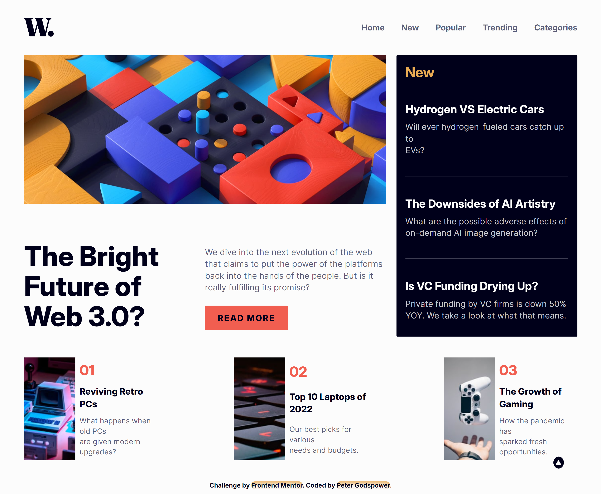
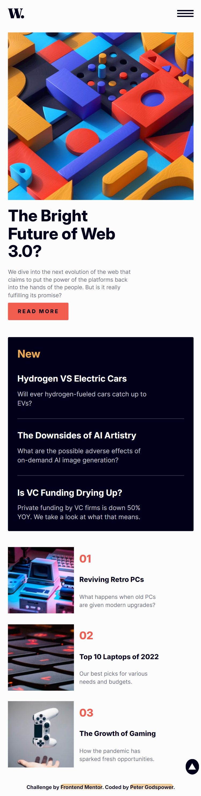

# Frontend Mentor | News Homepage

This is a solution to the News Homepage challenge on Frontend Mentor. The project involves creating a news homepage with a modern design that features a responsive layout, interactive elements, and smooth transitions.

## Table of Contents

- [Overview](#overview)
  - [Screenshot](#screenshot)
  - [Links](#links)
- [My Process](#my-process)
  - [Built With](#built-with)
  - [What I Learned](#what-i-learned)
  - [Continued Development](#continued-development)
  - [Useful Resources](#useful-resources)
- [Author](#author)
- [Acknowledgments](#acknowledgments)

## Overview

### Screenshot

### Links

- Solution URL: [Frontend Mentor Solution](https://www.frontendmentor.io/solutions/news-homepage)
- Live Site URL: [Live Demo](https://your-live-site-url.com)

## My Process

I developed a news homepage featuring a clean and dynamic design that adjusts seamlessly across various screen sizes. The page includes interactive elements like a responsive navigation menu, lazy-loaded images, and smooth scrolling effects.

### Built With

- **Semantic HTML5 Markup:** Utilized modern HTML elements for structuring the news homepage, improving readability and accessibility.
- **CSS Custom Properties:** Employed CSS variables for consistent styling and easy theming.
- **Flexbox & Grid:** Applied for layout and alignment, ensuring a responsive design across different devices.
- **Responsive Design:** Utilized `clamp()` for fluid typography and media queries to adapt the layout to various screen sizes.
- **JavaScript:** Managed user interactions and dynamic updates, including handling scrolling effects, lazy loading images, and responsive menu behavior.

### What I Learned

This project enhanced my skills in:

- **CSS Transitions:** Implementing smooth animations for interactive elements.
- **Responsive Design:** Applying CSS techniques for adaptable layouts and fluid typography.
- **JavaScript Event Handling:** Managing user interactions, including scrolling and lazy loading of images.
- **Performance Optimization:** Implementing lazy loading to improve page load times and performance.

### Continued Development

Future improvements will focus on:

- **Advanced JavaScript Features:** Adding more interactive elements and improving data handling techniques.
- **CSS Animations:** Experimenting with advanced CSS animations for a more engaging user experience.
- **Accessibility Enhancements:** Ensuring the component is fully accessible to users with diverse needs and preferences.

### Useful Resources

- [MDN Web Docs](https://developer.mozilla.org/en-US/) - Comprehensive documentation for web development.
- [CSS-Tricks](https://css-tricks.com/) - Tutorials and articles on modern CSS techniques.
- [Frontend Mentor](https://www.frontendmentor.io/) - Platform for frontend challenges and community feedback.

## Author

- **Frontend Mentor:** [@YourProfile](https://www.frontendmentor.io/profile/YourProfile)
- **GitHub:** [YourGitHubUsername](https://github.com/YourGitHubUsername)

## Acknowledgments

Special thanks to Frontend Mentor for providing this engaging challenge and to the community for their valuable feedback and support.
